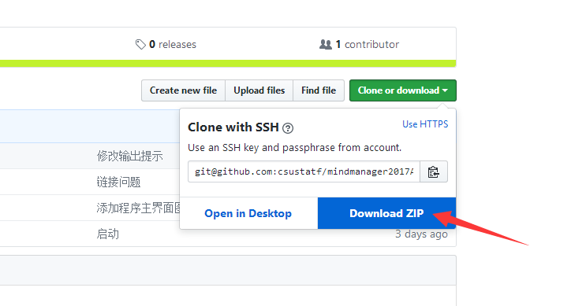
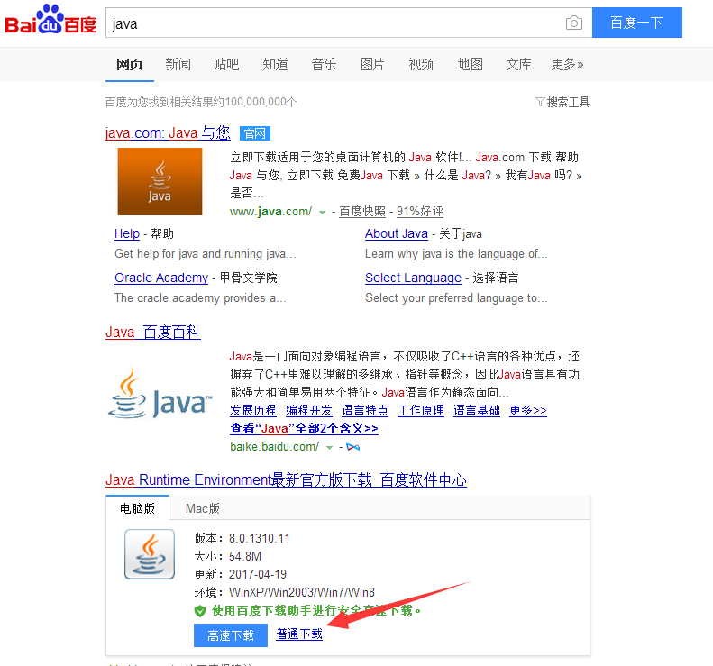

## 该网页一定要往下看，建议您花30秒的时间看完教程再操作！
## 如果您已经安装了MM2017，请先卸载，然后下载下面百度网盘提供的地址下载安装！
##  Mindmanger2017中文版激活工具  ##
### 关于激活码，可以在咸鱼搜索 MM2017服务 即可找到，真正的一机一码。不再是插件和补丁汉化等！真正的一键激活！
#####  注意：如果您的电脑已经安装了office,请安装您office的位数下载对应版本，否则安装的最后可能会卡住哦 ，因为mm2017也是office的一个插件哦。如果office是32位的，请安装32位的mm2017，否则就安装64位的，如果没有安装office，可以任意哈。 #####
# 下载地址 #
> 激活工具和mindmanager一样，都依赖于java运行环境，如果运行 启动.bat没有如下面一样出现界面。说明电脑的
   java环境没有装好，可以直接在百度软件中心，直接下载安装java即可。
   [百度下载地址](http://rj.baidu.com/search/index/?kw=Java%2520Runtime%2520Environment)
如果没有mindmanger2017下载的，我这里共享出百度网盘，根据自己电脑系统的位数下载指定版本即可。
mindmanager2017 最新版下载地址 链接：http://pan.baidu.com/s/1miyUFoc 密码：jui9

***

# 仅仅两步教程如下：
##### 1.安装完MM2017之后，下载激活程序压缩包，如下图所示

##### 2.把压缩包的所有文件全部拷贝到Mindmanger2017安装根目录，双击”启动.bat”，如下图所示，完成激活  #####

##### 备注    #####
> 有些网友反映，双击没有反应，就是没有出来界面哦。这是由于你的电脑没有安装java环境哦，
java是很多软件运行的环境，这个就不普及了，如果有兴趣可以百度一下哦。其中Mindmanger2017
需要java8环境的，而且激活软件同样依赖java，相信很多学计算机都晓得了。下载直接百度 java即可
如下图:

